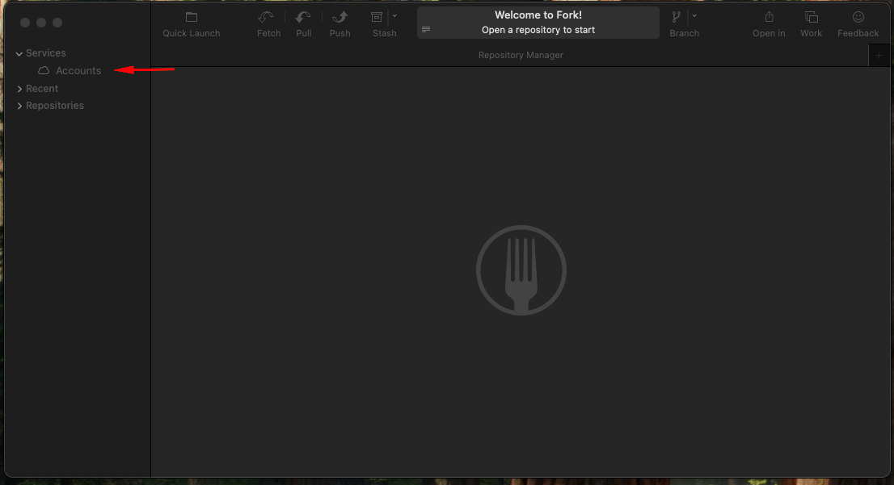

# Instalación del Cliente de Git Fork

## 1. Instalación en macOS

### Paso 1: Descargar Fork
- Visita el sitio web oficial de Fork: [https://git-fork.com/](https://git-fork.com/).
- Haz clic en el botón "Download for macOS" para descargar el archivo `.dmg`.

### Paso 2: Instalar Fork
- Abre el archivo `.dmg` descargado. 
- Arrastra el icono de Fork a la carpeta de "Aplicaciones".
- Ve a la carpeta de "Aplicaciones" y haz clic en el icono de Fork para abrir la aplicación. Puede que te solicite permisos para abrir una aplicación descargada de Internet.

### Paso 3: Configuración Inicial
- Abre Fork y configura tu cuenta de Git en la ventana de bienvenida.
- Ingresa tu nombre de usuario y correo electrónico asociados con tu cuenta de Git.
- ¡Listo! Ahora puedes empezar a usar Fork en tu sistema macOS.

## 2. Instalación en Windows

### Paso 1: Descargar Fork
- Accede al sitio web oficial de Fork: [https://git-fork.com/](https://git-fork.com/).
- Haz clic en "Download for Windows" para descargar el instalador `.exe`.

### Paso 2: Ejecutar el Instalador
- Abre el archivo `.exe` descargado y sigue las instrucciones en pantalla.
- Acepta los términos y condiciones y selecciona la ubicación donde quieres instalar Fork.
- Una vez completada la instalación, haz clic en "Finish" para abrir la aplicación.

### Paso 3: Configuración Inicial
- Cuando inicies Fork, se te pedirá configurar tu cuenta de Git.
- Ingresa tu nombre de usuario y correo electrónico.
- Fork está listo para usarse en tu sistema Windows.

## 3. Instalación en Linux

**Nota:** Actualmente, Fork no proporciona soporte oficial para Linux. Sin embargo, existen alternativas y métodos para usar Fork en Linux a través de Wine.

### Método Alternativo: Usar Fork en Linux con Wine
1. **Instalar Wine**:
   ```bash
   sudo apt update
   sudo apt install wine
- Para distribuciones basadas en Fedora:
    ```bash
    sudo dnf install wine
2. Descargar el Instalador de Windows: Descarga el archivo .exe de Fork desde el sitio web oficial.
3. Ejecutar el Instalador con Wine:
    ```bash
    wine fork-setup.exe
4. Configurar Fork:
    ```bash
    wine ~/.wine/drive_c/Program\ Files/Fork/Fork.exe
Y configura tu cuenta de git como en windows.

---
 
# Asociar una Cuenta de GitHub a Fork

## Paso 1: Abrir Fork
- Inicia la aplicación Fork en tu sistema (macOS o Windows). Si es la primera vez que abres la aplicación, verás la ventana de bienvenida.

## Paso 2: Acceder a la Configuración de Cuentas
- En la barra de menús superior, haz clic en **Fork** (en macOS) o en el menú principal (en Windows), y selecciona **Preferences** o **Settings** (Configuraciones).
- En la ventana de preferencias, navega a la sección **Accounts** (Cuentas).
- O en la barra lateral izquierda en la sección **Services** (Servicios) -> **Accounts** (Cuentas).


## Paso 3: Agregar una Cuenta Nueva
- En la sección de cuentas, verás un botón que dice **Add Account** (Agregar cuenta) O un botón con un signo **+**. Haz clic en él.
- Selecciona **GitHub** en la lista de opciones.

## Paso 4: Autenticar con GitHub
- Fork te pedirá que inicies sesión en tu cuenta de GitHub. Haz clic en **Sign In with GitHub** (Iniciar sesión con GitHub).
- Serás redirigido a tu navegador web, donde deberás iniciar sesión en tu cuenta de GitHub (si aún no lo has hecho).
- Autoriza a Fork para acceder a tu cuenta de GitHub haciendo clic en el botón **Authorize**.

## Paso 5: Confirmar la Conexión
- Una vez que autorices a Fork, serás redirigido nuevamente a la aplicación, y verás que tu cuenta de GitHub aparece en la lista de cuentas conectadas.
- En este momento, Fork ya está configurado para interactuar con tu cuenta de GitHub. Podrás clonar, gestionar y realizar acciones en tus repositorios directamente desde la interfaz de Fork.

## Paso 6: Probar la Conexión
- Para asegurarte de que la conexión fue exitosa, ve a la sección **Repository** (Repositorio) en la barra de menús y selecciona **Clone**.
- Deberías poder ver todos tus repositorios de GitHub en la lista y clonar cualquiera de ellos para trabajar en Fork.

## Notas Importantes
- Si tienes activada la autenticación en dos pasos (2FA) en tu cuenta de GitHub, es posible que necesites generar un **token de acceso personal**. Puedes hacerlo desde tu cuenta de GitHub en **Settings** > **Developer settings** > **Personal access tokens**. Luego, usa este token en lugar de tu contraseña cuando Fork te lo solicite.
- Es recomendable que Fork tenga acceso de **read/write** para poder gestionar los repositorios de manera eficiente, pero asegúrate de ajustar los permisos en GitHub según tus preferencias de seguridad.
